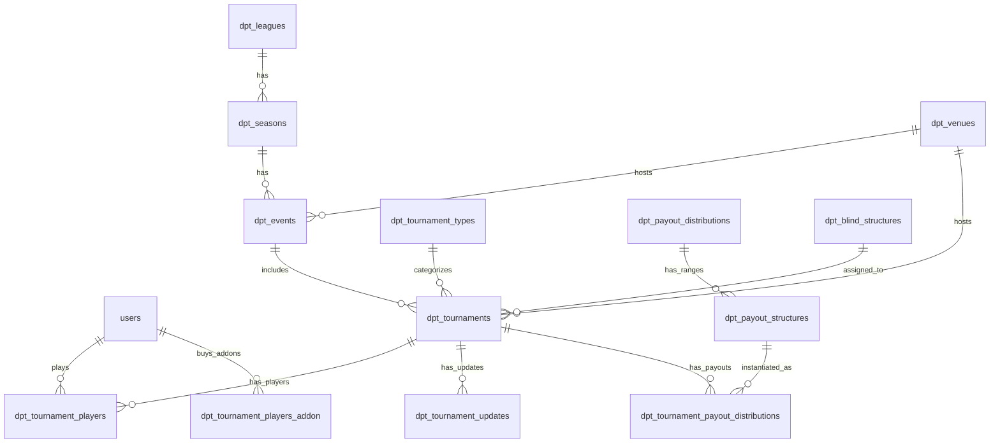

# 01 — Current Entity Map

Source: `/home/hermes/projects/dpt-web/src` Laravel app and `PEDRO_DEEP_DIVE_DPT_BACKEND.md`.

## Core entity groups

| Group | Current tables/models | Rebuild note |
|---|---|---|
| Identity | `users`, Spatie roles/permissions, Sanctum tokens | Split auth identity from player/admin profile data. |
| Tour structure | `dpt_leagues`, `dpt_seasons`, `dpt_events`, `dpt_venues` | Preserve hierarchy; add explicit manager/host assignment later if needed. |
| Tournament definition | `dpt_tournaments`, `dpt_tournament_types`, `dpt_blind_structures` | Current table mixes definition, operational state, and derived totals. |
| Tournament participation | `dpt_tournament_players`, `dpt_tournament_players_addon` | Rebuild as entries + add-on/rebuy ledger + computed/materialized totals. |
| Payouts | `dpt_payout_distributions`, `dpt_payout_structures`, `dpt_tournament_payout_distributions` | Separate reusable templates from per-tournament materialized payouts. |
| Content | `articles`, `categories`, `dpt_tournament_updates` | Public news/live updates; tournament updates appear article-linked too. |
| Notifications | `notifications`, `notification_entities`, `jobs` | Internal notification + email/SMS queue workflows. |
| Config | `configurations`, Laravel config/env | No `.env.example`; env inventory must be reconstructed. |

## Current ER map

## Important current fields

### `dpt_tournaments`

Carries:

- identity/content: `name`, `alias`, descriptions, logos, rules
- event placement: `season_id`, `event_id`, `venue_id`
- timing: `start_date`, `end_date`, registration windows
- economics: dealer fee, tournament fee, min/max buy-in, prize pool fields
- chips: initial chips, rebuy chips, blind info, blind structure
- type flags: tournament type, freeroll, qualifier, satellite winner flag
- operations: registration closed, closed by/date, total players/payouts
- advancement: flight/main linkage, chip accumulator, stop flight flag
- TOC qualification text fields

### `dpt_tournament_players`

Carries:

- player/tournament IDs
- pre-registration/check-in flags
- initial buy-in and chips
- add-on count and chip totals
- total buy-in amount
- rank, winnings, score, bounty
- elimination sequence/final table
- duplicate and flight qualification flags

## Normalization targets

| Current field/pattern | Proposed target |
|---|---|
| `qualifier_tournament_ids` text | `tournament_qualifiers` join table |
| `toc_qualified_type_ids` text | `toc_qualified_types` join table |
| `toc_qualified_tournament_ids` text | `toc_qualified_tournaments` join table |
| `dpt_tournament_players_addon` + summary fields | `tournament_entry_addons` ledger + computed totals |
| Flight mutation flags | `flight_advancements` ledger |
| `subscribed_to` JSON | notification preferences rows or constrained JSONB |
